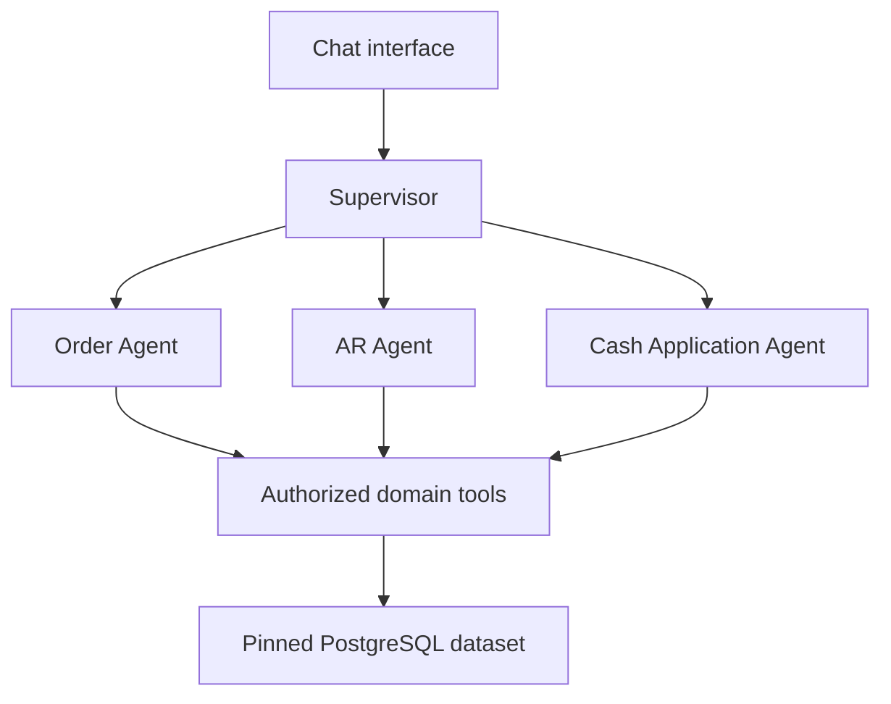

# RevenueFlow AI — Supervisor and Specialist Agent Contract

## Architecture decision

Implement four agent modules in one backend: a Supervisor, Order Agent, AR Agent, and Cash Application Agent. The supervisor coordinates a typed internal transport; domain services perform deterministic queries/calculations. The chatbot calls the supervisor. This is an application-level multi-agent architecture. The first release does not implement the external A2A protocol.

Raw CSV import, storage, authentication, and document indexing are supporting services governed by intent.md. No agent talks directly to unrestricted SQL or arbitrary uploaded executables.

## Agent responsibilities

| Agent | Responsibilities | Tool permissions |
|---|---|---|
| Supervisor | Interpret questions, resolve conversational references, build a bounded plan, dispatch relevant specialists, validate/merge findings, and return cited results | Entity resolution and typed specialist dispatch only; no financial writes |
| Order | Order trace, shipment/billing reconciliation, recorded holds, missing fulfillment evidence | get_order_trace, list_unbilled_shipments, get_order_holds, scoped order/document evidence |
| AR | Invoice balances, aging, disputes, customer receivable summary | get_invoice_details, get_aging_summary, get_disputes, scoped AR/document evidence |
| Cash Application | Receipt balances, references, match proposals, residuals, ambiguity | get_receipt_details, find_receipt_matches, scoped receipt/document evidence |

Shared read-only entity lookup may be exposed to specialists where required. Cash matching can query invoice balances via its authorized domain service; it need not call the AR agent. Each specialist must have a separate role prompt, typed interface, tool allowlist, and tested behavior. Shared provider/client utilities are encouraged. Do not create separate servers or duplicate databases merely to make agents look independent.

## Routing contract

| User request | Required specialists |
|---|---|
| Which shipments are unbilled? Why is this order on hold? | Order |
| Which invoices are overdue? Explain this invoice dispute. | AR |
| Which invoices match this receipt? Show unapplied cash. | Cash Application |
| Customer outstanding balances, cash, disputes, and holds | Order + AR + Cash Application |
| Why is this customer's collection delayed? | AR + Cash Application; add Order when fulfillment/billing evidence is relevant |
| A question unsupported by available data | Clarify or report limitations; do not dispatch every agent by default |

Exact ID lookups and common demo question intents can use deterministic routing. For flexible live-language requests, a validated model-generated plan may select the specialist allowlist. Validate plan size, domain, inputs, and scope before execution. Entity names with multiple matches require a clarification with authorized candidate names; never silently select a customer. No specialist is allowed to recursively call the supervisor or another specialist.

## Trusted execution context

Construct the context server-side from the authenticated request. Client and model text cannot override it. Propagate:

- investigation_id, conversation_id, turn_id, trace_id, task_id, parent_task_id
- authenticated actor ID, organization ID, allowed business-unit IDs
- dataset_version_id, business as-of date, source snapshot date
- monotonic execution deadline, remaining request-wide tool/model/token budgets
- validated resolved entity IDs, cancellation handle, provider/demo mode

Dataset IDs must be authorized for the selected scopes. Tools independently enforce trusted context. Persist task metadata and sanitized results; never persist bearer tokens. Recheck current permissions on each turn and evidence access. If access is revoked while a turn runs, cancel or suppress inaccessible results before rendering. Source context must be preserved in citations and drill-down links.

## Task and result schemas

Implement validated typed models; generate JSON schemas and include sample payloads in repository docs. A TaskRequest contains schema_version, task_id, domain, intent, resolved_entity_ids, filters, and the trusted context reference. A task has queued/running/completed/failed/cancelled/timed_out states with timestamps and a safe error code.

A SpecialistResult contains:

- schema_version, task_id, domain, status: success / partial / needs_clarification / failed
- dataset_version_id and as_of_date matching the task
- findings with stable finding keys, factual statements, and resolvable evidence references
- metrics with name, decimal-string value, unit/currency, scope, and calculation provenance
- proposed actions with evidence and required human review, no execution assertion
- missing_data, ambiguity, warnings, and safe error codes
- execution metadata: tool calls, provider calls, usage, duration

Evidence references identify source type, record/document ID, file/row or page/section, and dataset. Server-side validation must reject nonexistent, wrong-version, or unauthorized citations. Don't require a specialist to succeed merely because its output is syntactically valid: the cited evidence must support key financial claims.

The FinalInvestigation contains summary, findings, specialist status summaries, evidence references, recommended actions, missing data, and dataset metadata. Keep aggregate facts separate by currency and metric type. Deduplicate repeated evidence/finding keys, not independent amounts. The supervisor must not recalculate or add balances from prose. Use deterministic metric services if an aggregate is needed. Label inferred relationships as hypotheses, with actual evidence and limitations.

## Execution controls

Use configurable defaults: at most three specialist dispatches per turn, no recursive delegation, at most two concurrently executing specialists, at most 24 domain tool calls and 12 model requests per whole turn, and a 60-second overall deadline. Define a request-wide token budget (initial default 24,000 billable input/output tokens, adjustable to the selected model). Count repeated input usage rather than only new text. Reserve capacity for final synthesis and use conservative preflight estimates plus actual provider usage. If a budget is insufficient, return available findings with an explicit limit message. Configured model context limits are a separate bound.

Reserve budget allocations before parallel work so racing calls cannot exceed the whole-turn limit. Per-tool timeout defaults to ten seconds; provider request timeouts must fit the remaining overall deadline. Retry transient failures only within the same deadline/budget. Prevent duplicate task execution using a stable dispatch key derived from investigation, turn, domain, normalized task, and dataset. Do not reuse results across unauthorized scopes, different datasets, or as-of dates.

Cancelling chat cancels pending tasks and stops initiating new calls. Propagate cancellation to running work where supported; ignore late results after cancellation and record already-incurred usage honestly. Track task state durably. On process restart, mark abandoned model tasks interrupted and allow an explicit retry; do not pretend the original stream is still running. The durable ingestion worker has separate recovery semantics.

If a specialist fails, return successful specialist findings with a partial-result banner and identify the unavailable domain. Never manufacture its result. If all fail, return a useful error/retry state. Bounded final synthesis must not turn failed tasks into asserted facts. User-facing progress describes routing and tool activity, never hidden chain-of-thought.

## Chat memory and streaming

Persist user messages, safe final answers, entity references, scope/dataset metadata, and task summaries. Resolve follow-ups such as “only those over 60 days” against the immediately relevant result/filter state. Do not send unlimited conversation history to the model; use bounded structured summaries that preserve IDs, constraints, and citations. If a reference is ambiguous, ask a focused clarification. An explicit dataset switch starts a new investigation context; historical answers retain their old provenance while authorized.

Use SSE or a documented equivalent for supervisor/task progress and final results. Authenticate the stream, handle reconnects with event IDs, sanitize event payloads, and avoid exposing credentials or raw sensitive tool dumps. Validate results before emitting factual answers; provisional UI events may show progress but not unverified financial claims.

## Credential-free demo and live mode

Demo mode uses deterministic routing/specialist decisions and actual domain queries over imported synthetic CSVs. It supports the required demo intents and follow-ups and clearly states when a request is outside its supported patterns. Live mode uses actual Anthropic calls behind a provider adapter, with specialist-specific tools and final synthesis. Tests without a key may use provider doubles for error/schema behavior; tests must not label those doubles as live AI execution.

## Required verification

- Single-domain and cross-domain routing; ambiguous entities; no unnecessary specialist fan-out.
- Context preservation and rejection of spoofed organization, dataset, deadline, or budgets.
- Scope checks at tool/evidence/export access and after permission revocation.
- Partial failure, all-failed response, timeout, cancellation, interrupted process, deduplication, and concurrent budget accounting.
- Supported follow-ups and dataset activation during a conversation.
- Fabricated citations, injected CSV/document instructions, wrong currency/version metrics, and duplicate metric aggregation.
- Structured contract validation and per-specialist tool allowlists.
- Deterministic demo runs plus opt-in live evaluation with measured usage and latency.

## Future A2A protocol migration

Provide an AgentTransport interface and an InternalAgentTransport implementation. Document how TaskRequest/SpecialistResult would be mapped to a supported A2A protocol version if specialists are independently deployed. Before implementing that extension, consult current official A2A specifications/SDK documentation and pin a version. The design must address agent discovery/capability metadata, task lifecycle, authenticated service identities, delegated user scope, streaming/cancellation, replay protection, evidence provenance, and conformance tests. An internal HTTP endpoint or JSON message alone is not evidence of protocol compliance. External protocol support is not required for this release.
