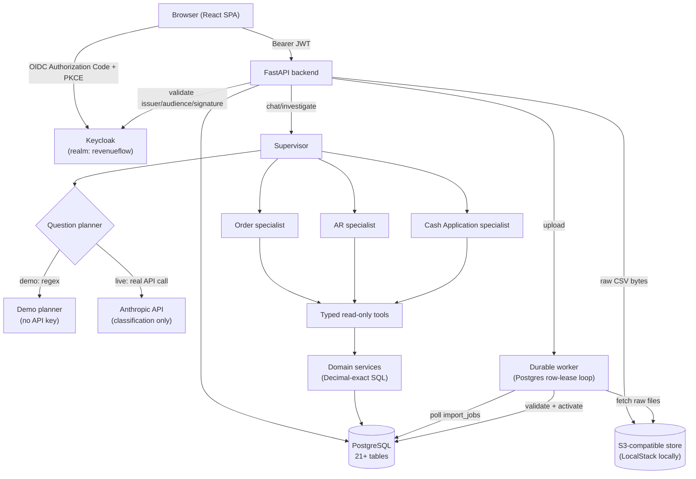

# Architecture

Status: reflects what is actually built as of this writing (see
`docs/implementation-plan.md` for the live milestone tracker and
`docs/acceptance-report.md` for criterion-by-criterion evidence). This is
not an aspirational design document — every component named here exists
in the repository and has been run against the real stack.

## System diagram

## Components

| Component | Technology | Responsibility |
|---|---|---|
| Frontend | React 18 + TypeScript, Vite, React Router, TanStack Query | SPA: login, dashboard, chat, exception workbench, task queue, CSV import |
| Backend | FastAPI (async), Pydantic v2 | REST API, auth enforcement, request orchestration |
| Database | PostgreSQL 16, SQLAlchemy 2.x async, Alembic | System of record; all financial calculation happens in SQL/Python Decimal code, never in a model |
| Worker | Plain asyncio loop, Postgres `SELECT...FOR UPDATE SKIP LOCKED` leases | Durable import-job processing; survives restarts without an external queue broker |
| Object storage | S3-compatible (`boto3`/`aioboto3`), LocalStack locally | Raw CSV bytes, content-hashed, keyed by org/job/filename |
| Identity | Keycloak (self-hosted OIDC) | Real Authorization Code + PKCE flow, 4 realm roles mapped to app roles |
| Agent layer | Custom (no agent framework) | Supervisor + 3 specialists behind a typed internal transport (see below) |
| Live AI | Anthropic API (`anthropic` Python SDK) | Question classification only (forced tool-choice) — never computes a financial figure |

## Request flow: a chat investigation

1. Browser sends `POST /api/v1/chat/investigate` with a Bearer JWT, a question, and a business-unit scope.
2. `auth/deps.py` validates the JWT against Keycloak (issuer/audience/signature/expiry) and resolves the caller's `AppUser` row (role + organization).
3. The handler resolves the business unit's active `DatasetVersion` — if none, it returns 409 rather than guessing.
4. A `QuestionPlanner` (demo regex or live Anthropic call) turns the question into a bounded, validated list of `(domain, intent)` dispatches plus extracted entity IDs. `validate_plan` rejects anything outside a fixed domain/intent allowlist before it reaches a specialist, treating a model-generated plan as untrusted input.
5. The Supervisor dispatches each task through `InternalAgentTransport` to the matching specialist handler (Order/AR/Cash), each scoped to its own typed tool allowlist.
6. Each specialist calls read-only tools (`agents/tools.py`) that wrap SQL-backed domain services (`domain/*.py`) — all Decimal-exact calculations happen here, never in a model.
7. The Supervisor deduplicates findings/evidence across specialists and returns a `FinalInvestigation`.
8. The turn (question + answer + specialist status + evidence + missing-data) is persisted to `conversations`/`chat_messages`.

## Agent architecture (internal, not A2A)

Per `docs/agent_architecture.md`, this release implements the Supervisor
and three specialists as modules inside one backend process, communicating
through a typed internal contract (`agents/contracts/`) and an
`AgentTransport` interface (`agents/transport/`) with one implementation,
`InternalAgentTransport`. **This is explicitly not an A2A-protocol
deployment** — there are no independent specialist services, no
service-to-service authentication, and no claim of A2A compliance
anywhere in this codebase. The `AgentTransport` interface exists so that,
if specialists were later split into independent services, only a new
transport implementation would be needed — the Supervisor and specialist
handler signatures would not change. See `agent_architecture.md`'s
"Future A2A protocol migration" section for what that would require
(agent discovery, authenticated service identities, replay protection,
conformance tests) — none of it is built, and none of it is implied by
anything in this repository today.

## Data model summary

Every ingested business record (customers, orders, invoices, receipts,
etc. — the 13 CSV files from `intent.md`'s contract) carries:

- A surrogate UUID primary key plus `external_id` (the original CSV ID string, preserving leading zeros)
- `organization_id`, `business_unit_id`, `dataset_version_id` — every query is scoped by all three
- Lineage: `import_job_id`, `source_filename`, `source_row_number`

A `DatasetVersion` is an immutable, activated snapshot; only one is
`is_active=True` per (organization, business_unit) at a time. Activating a
new version transactionally supersedes the old one — see
`ingestion/activation.py`. See `docs/data-dictionary.md` for the full
per-file column reference.

## What is not yet built

- SSE/streaming chat responses (current endpoint is synchronous)
- Document evidence (TXT/PDF) ingestion/retrieval
- Independent/A2A-protocol agent deployment (explicitly out of scope for this release)
- Full observability (correlation IDs, metrics export)

See `docs/implementation-plan.md` for the complete, currently-maintained gap list.
